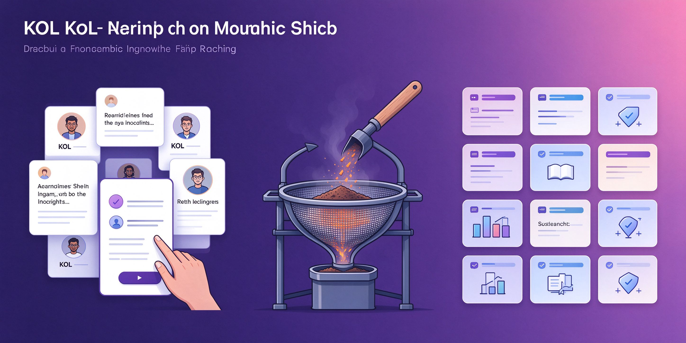

# kol-content-research

**研究 KOL 的内容内涵（观点/方法论/知识体系），不学语言风格。**

  

## 和风格模仿的区别

| 工具 | 提取什么 |
|------|---------|
| 本工具 | 观点、方法论、知识体系（用于知识库） |
| xhs-style-imitation | 语气、句式、emoji（用于写新笔记） |

## 流程

定位账号 → 全量拉帖 → 主题聚类 → 提炼框架 → 输出结构化分析

## License

MIT
